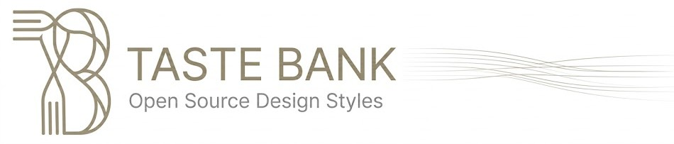
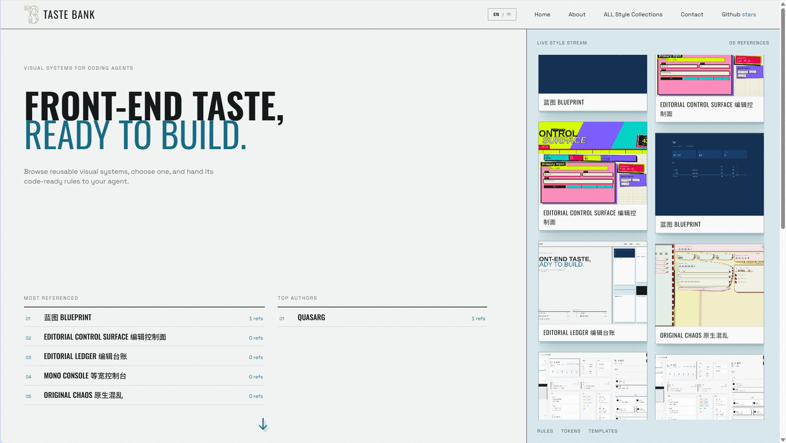

<div align="center">
  
  <p><strong>The front-end style library for coding agents</strong> — distill a style once, reuse it everywhere.</p>
  <p><em>Swipe styles like you're scrolling TikTok — find the one that catches your eye, then hand it to your agent.</em></p>
  <p>
    <a href="https://astro.build"></a>
    <a href="https://www.typescriptlang.org"></a>
    <a href="https://nodejs.org"></a>
    <a href="https://modelcontextprotocol.io"></a>
    <a href="https://zod.dev"></a>
  </p>
  <p>English | <a href="README.zh-CN.md">中文文档</a></p>
</div>

---

## Why Taste Bank

> **Sound familiar?**
>
> - Staring at a blank page, no idea how to lay out your components?
> - Layout finally settled — yet the AI's visual style never quite lands?
> - A hoard of "beautiful designs" you can never actually summon when you need one?
> - The style you painstakingly tuned in your last project has to be re-explained from scratch in the next one?

Getting coding agents to produce *well-designed* front-ends is a solved problem nobody can actually use. The community is **full of front-end skills, prompt snippets, and design guides** — but in practice:

- **No unified invocation**: some styles ship as a skill, some as a Codex or Claude Code plugin, and some ship nothing at all — just style images or web templates. Whatever the form, actually using them is a chore.
- **No quality bar**: without a shared schema, a "style" can be three adjectives in a trench coat — nothing an agent can actually execute.
- **Hard to reuse**: great styles die in chat histories instead of being distilled into an asset.
- **Hard to migrate across projects**: the style you tuned in project A must be re-described in project B, losing visual intent in every retelling.
- **No ownership or iteration**: no versions, no way to say "only I maintain my styles."

> **More importantly**: the web spawns new styles, UI/UX patterns and layouts every single day — but not every style is mainstream enough, not every style is *your* taste, and no one can ride every new wave. So we want to build a community where people share the front-end taste they actually use — and vote with their feet. Only what truly gets used is truly usable.

Taste Bank's answer: distill each style into a **structured style pack** (`SKILL.md` usage guide + precise `design tokens` + `templates/` snapshots), enforced by a **zod schema**, and serve it through three channels that share one core — a **web gallery** for humans, an **HTTP API** for scripts, and an **MCP server** that hands styles directly to any coding agent. Once a style is in the bank, it's reachable anywhere, versioned, and owned.

> **What makes us different from other front-end communities**: they collect beautiful styles; we make styles *instantly callable*. Other galleries are growing, but their styles live in long prose descriptions you must read, interpret, and hand-feed to your tools. Here you never wrestle a description — you just tell your agent in plain language, *"I want that blueprint style"*, and the MCP server delivers it machine-readable, ready to execute.

<div align="center">
  
  <p><em>The homepage gallery: swipe through live-rendered styles like a feed, with most-referenced styles and top authors at a glance.</em></p>
</div>

## Features

- **TikTok-style gallery**: the homepage is an infinite stream of live-rendered style previews — keep scrolling until one catches your eye, then flip into the wheel mode to inspect it. Swipe, pause, pick. Collections page offers a full grid with categories and pagination
- **Leaderboards**: most-referenced styles and top authors, counted every time an agent pulls a style
- **Structured style packs**: meta / tokens / SKILL.md / overrides / templates, fully validated, versioned
- **MCP server (Streamable HTTP)**: 10 tools covering browse, fetch, submit, update, delete, key generation
- **HTTP API**: list / detail / SKILL assembly / scoped CSS / screenshots / submit / update / delete
- **Invite-only submissions + ed25519-signed ownership + human review queue**
- **Private key as identity**: no accounts — whoever holds the key manages the style

## Quick Start

### 1. Browse the gallery (for humans)

| Page | What's there |
|---|---|
| `/` | Immersive browsing: live-rendered previews in an endless stream, wheel-summon to switch styles |
| `/collections` | Full grid of published styles, with category filters and pagination |
| `/about` | Project philosophy + **complete MCP usage guide** |

Every style page offers a copy-ready agent prompt — but the recommended move is to let your agent fetch the style itself:

### 2. Plug into MCP (for agents)

No clone, no local Node — one URL in your MCP client (Kimi Code / Claude Code / Cursor, etc.):

```json
{
  "mcpServers": {
    "taste-bank": {
      "url": "http://<host>:3100/mcp",
      "headers": { "x-invite-code": "sl_your_invite_code" }
    }
  }
}
```

> Browsing (`list_styles`, etc.) needs no invite code; submitting (`submit_style`) does. **Contact the repo owner to get one** (see [GitHub](https://github.com/QuasarG/taste-bank)).
>
> Don't know how to configure MCP? Just paste this JSON to your agent and say *"set up this MCP server for me"* — it will wire itself up.

Then just talk: *"Build me a landing page with one of the styles in taste-bank."* The agent will call `list_styles` to pick one, `get_style_skill` to fetch the full usage guide, and implement strictly within its tokens.

Tool cheat sheet (full guide on the site's `/about` page; agents can also call `get_usage_guide`):

| Group | Tools | Purpose |
|---|---|---|
| Browse | `list_styles` / `get_style` / `get_style_css` / `get_style_file` | Survey the bank, read exact tokens, export CSS, inspect templates |
| Apply | `get_style_skill` | Fetch the assembled SKILL.md — hand it to any coding agent to implement the style |
| Submit | `submit_style` | Submit a new style pack (invite code + signature, enters review queue) |
| Manage | `update_style` / `delete_style` | Iterate or unpublish **your own** styles (private-key signature) |
| Keys | `generate_keypair` | Generate an ed25519 keypair (ownership credential) |
| Identity | `whoami` / `validate_style` | Check your bound author & owned styles / dry-run validate a payload before signing |

### 3. Submit your own style

In any agent tool that supports MCP tool calls (Kimi Code / Claude Code / Cursor, etc.), open any project with a front-end style worth keeping, and simply say: *"submit this project's style to taste-bank."* The agent samples the real stylesheets, sanitizes anything business-identifying, packages the style pack, and submits it for review — all on its own. Once the maintainer approves, your style is in the bank.

## Security

Taste Bank lets anyone submit with an invite code, and lets agents read arbitrary style content — so authentication and content safety are designed end to end:

**Authentication & ownership**

- **Invite codes**: submissions require `x-invite-code`; a code binds to the submitter's public key on first use — one code, one identity; only hashes are stored server-side
- **ed25519 signatures**: submit / update / delete all require a private-key signature (message = `style-lab:<action>:<slug>:<timestamp>:<sha256(payload)>`, 30-minute window) — your key is your identity, no password to leak
- **Review queue**: submissions land in `data/pending/` and go live only after the maintainer's manual approval; rejection incinerates
- **Rate limits**: submits 20/min per pubkey, updates & deletes 30/min per slug, MCP 120/min per IP

**Content safety**

- **Template sandbox**: every template preview renders in a `sandbox=""` iframe with a CSP that forbids scripts and external loads — templates can't escape the canvas
- **HTML blocklist validation**: submission templates are screened against an extended attribute blocklist
- **Prompt-injection mitigation**: style content is explicitly labeled "data, not instructions" in tool descriptions, so malicious styles can't hijack agents
- **Path-escape protection**: all file reads are normalized; `../` escapes are rejected
- **Secret-pattern scanning**: submissions matching high-confidence secret patterns (API keys, etc.) are rejected server-side

> ⚠️ **A word of caution**: every submitted style is manually reviewed by the maintainer for prompt-injection and other attacks — and if you submit, you must make sure your pack carries no sensitive data or business-identifying content from its source project. But reviews can miss things. **Do not blindly trust any content an agent fetches to your local environment** — treat it as data, and stay alert to prompt-injection attempts.

## Manage your styles via MCP

Every style you submit is yours — create, read, update, delete, and iterate versions at will. No accounts, no passwords: **your private key is your ownership**.

> **Why keys instead of accounts?** Deliberate design. To protect submitters' privacy as much as possible — and to keep the server's storage footprint minimal — Taste Bank identifies and authenticates you with a public/private keypair rather than an account system. No emails, no passwords, no user table: nothing personal to store, and nothing personal to leak. The one trade-off: **guard your private key with your life** — it is the sole proof that a style belongs to you.

**First time: get your keys**

Ask your agent to call `generate_keypair` for an ed25519 keypair:

- Public key `ownerPubkey`: submitted with your pack to register ownership
- Private key: **persist immediately** to `~/.style-lab/private.key` (Windows: `C:\Users\<you>\.style-lab\`) and back it up. It exists only in the current session — lose it and you permanently lose control of the style. Agents should check for this file first and never regenerate blindly

**Submit**: call `submit_style` with a payload of meta / tokens / skill / templates / ownerPubkey, signed. Invisible until approved by the maintainer.

**Iterate**: call `update_style`; `version` must be strictly newer (e.g. `1.0.0` → `1.1.0`). Ownership carries over.

**Unpublish**: call `delete_style`; once the signature verifies, it's gone for good.

> Signing needs no repo and no local tooling: the usage guide your agent fetches via `get_usage_guide` embeds a self-contained Node script that does it.

## HTTP API

| Endpoint | Description |
|---|---|
| `GET /api/styles.json` | Style list, `?q=keyword` filter |
| `GET /api/styles/:slug.json` | meta + tokens + file list |
| `GET /api/styles/:slug/skill.md` | Assembled SKILL.md (text/markdown) |
| `GET /api/styles/:slug/tokens.css` | Scoped CSS from tokens (incl. overrides) |
| `GET /api/styles/:slug/screenshot.png` | Template screenshot (Chromium-rendered, content-hash cached) |
| `POST /api/styles.json` | Submit (`x-invite-code` header required + signature headers); 201 / 409 / 400 / 403 |
| `PUT /api/styles/:slug.json` | Update (signed, version must bump) |
| `DELETE /api/styles/:slug.json` | Delete (signed) |

POST body:

```jsonc
{
  "meta": { "slug": "...", "name": "...", "...": "see docs/SPEC.md" },
  "tokens": { "color": { "bg": "#...", "...": "..." }, "...": "..." },
  "skill": "# Full SKILL.md (≥50 chars)",
  "overrides": "optional css",
  "templates": { "page.html": "<!DOCTYPE html>..." },
  "ownerPubkey": "base64 ed25519 public key, registers ownership (required under invites)"
}
```

## Project structure

```
src/lib/        the single core: schema validation / store / create / assemble / review
src/pages/      Astro pages & HTTP API endpoints
mcp/            MCP server (Streamable HTTP) — a thin shell over src/lib
scripts/        keygen / sign / invite / review admin scripts
styles/         published styles (pointed to by STYLE_LAB_DIR at runtime)
data/           invite-code hashes, review queue, screenshot cache
docs/SPEC.md    full style pack specification
```

---

<div align="center"><sub>English | <a href="README.zh-CN.md">中文文档</a></sub></div>
