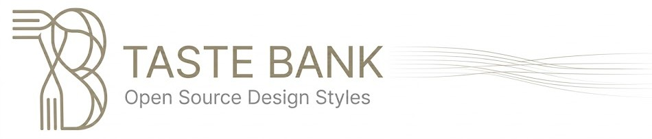
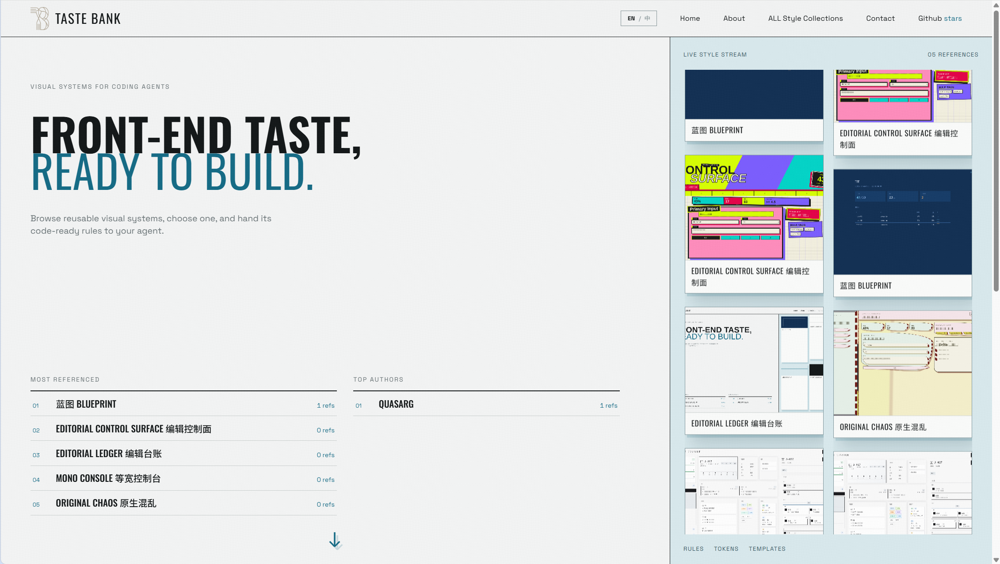

<div align="center">
  
  <p><strong>The front-end style library for coding agents</strong> — distill a style once, reuse it everywhere.</p>
  <p><em>Swipe styles like you're scrolling TikTok — find the one that catches your eye, then hand it to your agent.</em></p>
  <p>
    <a href="https://www.npmjs.com/package/taste-bank"></a>
    <a href="https://astro.build"></a>
    <a href="https://www.typescriptlang.org"></a>
    <a href="https://zod.dev"></a>
  </p>
  <p>
    <a href="https://tastebank.cloud"></a>
    <a href="https://github.com/QuasarG/taste-bank"></a>
  </p>
  <p>English | <a href="README.zh-CN.md">中文文档</a></p>
</div>

---

## Quick Start

**One command sets you up** — installs the CLI globally and teaches your coding agents (Claude Code, Codex, Cursor, ZCode, Kimi Code…) how to use it:

```bash
npx taste-bank setup
```

Then just talk to your agent in plain language:

> *"Build me a landing page with one of the styles in taste-bank."*

Your agent already knows what to do — `setup` injected a skill that teaches it the `taste-bank` CLI commands. It will browse styles, fetch the complete pack, and implement strictly within the design tokens.

**Prefer the terminal?**

```bash
taste-bank list                    # browse all styles
taste-bank skill <slug>            # get the complete pack (meta + tokens + skill + css + templates)
taste-bank use <slug>              # land a style into your project as a rules file
```

That's it. No MCP configuration, no JSON to paste, no manual setup per agent.

> **Browse visually first?** The [web gallery](https://tastebank.cloud) is an endless stream of live-rendered style previews — find one you like, note its slug, then `taste-bank skill <slug>`.

---

## Why Taste Bank

> **Sound familiar?**
>
> - Staring at a blank page, no idea how to lay out your components?
> - Layout finally settled — yet the AI's visual style never quite lands?
> - A hoard of "beautiful designs" you can never actually summon when you need one?
> - The style you painstakingly tuned in your last project has to be re-explained from scratch in the next one?

Getting coding agents to produce *well-designed* front-ends is a solved problem nobody can actually use. The community is **full of front-end skills, prompt snippets, and design guides** — but in practice:

- **No unified invocation**: some styles ship as a skill, some as a plugin, some ship nothing at all. Actually using them is a chore.
- **No quality bar**: without a shared schema, a "style" can be three adjectives in a trench coat — nothing an agent can actually execute.
- **Hard to reuse**: great styles die in chat histories instead of being distilled into an asset.
- **No ownership or iteration**: no versions, no way to say "only I maintain my styles."

> **More importantly**: the web spawns new styles every day — but not every style is mainstream enough, not every style is *your* taste. We want a community where people share the front-end taste they actually use — and vote with their feet. Only what truly gets used is truly usable.

Taste Bank's answer: distill each style into a **structured style pack** (`SKILL.md` usage guide + precise `design tokens` + `templates/` snapshots), enforced by a **zod schema**, served through a **CLI + skill injection** that works with any coding agent. Once a style is in the bank, it's reachable anywhere, versioned, and owned.

<div align="center">
  
  <p><em>The homepage gallery: swipe through live-rendered styles like a feed — horizontal card rail with interactive preview, most-referenced styles and top authors at a glance.</em></p>
</div>

---

## Features

- **One-line setup**: `npx taste-bank setup` installs the CLI and injects skills into all your coding agents (Claude Code, Codex, Cursor, ZCode, Kimi Code, and 70+ more via the open `skills` ecosystem)
- **Complete style packs**: `taste-bank skill <slug>` returns the full pack in one call — meta, tokens, SKILL.md rules, scoped CSS, and HTML template snapshots. Agents get everything they need.
- **3-day local cache**: packs are cached; if the server is unreachable, the CLI falls back to cache
- **TikTok-style gallery**: [tastebank.cloud](https://tastebank.cloud) — endless stream of live-rendered previews, horizontal card rail, leaderboards
- **Structured & validated**: every pack passes a strict zod schema (meta / tokens / skill / templates), versioned, with invite-only submissions + ed25519-signed ownership + human review
- **Submit from the terminal**: `taste-bank submit` — sign and submit a new style without leaving your project
- **Private key as identity**: no accounts — whoever holds the key manages the style

---

## CLI Commands

### Browsing & applying (no auth)

| Command | What it does |
|---|---|
| `taste-bank list [--q WORD] [--json]` | List published styles |
| `taste-bank show <slug> [--json]` | Style detail (meta + design tokens) |
| `taste-bank skill <slug> [--md]` | **Complete pack** as JSON: `{meta, tokens, skill, css, templates}`. `--md` for plain SKILL.md |
| `taste-bank use <slug> [--as agents\|claude\|skill]` | Land a style into your project (managed sentinel block, won't clobber your edits) |
| `taste-bank favorite <slug>` / `unfavorite` / `favorites` | Manage favorites |
| `taste-bank doctor` | Health check (CLI, network, identity, skill injection, cache) |

### Contributing (invite + ed25519 identity)

| Command | What it does |
|---|---|
| `taste-bank keygen` | Generate an ed25519 keypair into `~/.style-lab/` (one-time) |
| `taste-bank whoami` | Your bound identity, owned styles, pending submissions |
| `taste-bank validate <pack.json>` | Dry-run validate a pack locally (no network) |
| `taste-bank submit <pack.json>` | Submit a new style (needs invite code + private key) |
| `taste-bank update <slug> <pack.json>` | Update an owned style (version must bump) |
| `taste-bank delete <slug>` | Delete an owned style (asks to confirm) |

---

## How it works

```
npx taste-bank setup
  ① npm install -g taste-bank              (install CLI globally)
  ② npx skills add …/taste-bank -g         (inject 2 skills into your agents:
                                             taste-bank for browsing/applying,
                                             taste-bank-contribute for submitting)
  ③ environment check                      (report state, read-only)
```

Two skills are injected (via the open [skills](https://skills.sh) ecosystem):

- **`taste-bank`** — teaches your agent the CLI commands for browsing and applying styles
- **`taste-bank-contribute`** — the full contribution SOP: how to sample a project, pack a style, sanitize it, and submit

After setup, your agent knows the CLI. You just say *"use a taste-bank style"* and it runs the commands itself.

The CLI talks to `tastebank.cloud` by default and caches packs locally for 3 days. Self-host? Set `TASTEBANK_API=https://your-host`.

---

## Submit your own style

```bash
# One-time identity setup
taste-bank keygen
echo '{ "inviteCode": "sl_xxx" }' > ~/.style-lab/config.json  # get a code from the maintainer

# From any project with a style worth keeping:
taste-bank validate my-style.pack.json    # dry-run check
taste-bank submit my-style.pack.json      # sign + submit (enters review queue)
```

Or just tell your agent: *"submit this project's style to taste-bank"* — the injected `taste-bank-contribute` skill guides it through the full SOP (sample 2 files max, extract real tokens, sanitize business-identifying content, pack, validate, submit).

See the [pack format](docs/SPEC.md), the `taste-bank-contribute` skill, and the **[agent workflow guide](docs/agent-workflow.md)** (how to manage project styles in agent conversations). 中文版见 [Agent 工作流指南](docs/agent-workflow.zh-CN.md)。

---

## Security

**Authentication & ownership**

- **Invite codes**: submissions require an invite code; a code binds to the submitter's public key on first use — one code, one identity; only hashes stored server-side
- **ed25519 signatures**: submit / update / delete all require a private-key signature (message = `style-lab:<action>:<slug>:<timestamp>:<sha256(payload)>`, 30-min window) — your key is your identity
- **Review queue**: submissions land in `data/pending/` and go live only after maintainer approval
- **Rate limits**: 20 submits/min per pubkey, 30 manages/min per slug

**Content safety**

- **Template sandbox**: previews render in a `sandbox=""` iframe with CSP forbidding scripts/external loads
- **HTML blocklist + secret-pattern scanning**: submissions are screened for dangerous attributes and high-confidence secret patterns
- **Prompt-injection mitigation**: style content is labeled "data, not instructions" in skill descriptions

> ⚠️ Every submission is manually reviewed. But reviews can miss things — **do not blindly trust fetched content**; treat it as data.

---

## MCP (legacy compatibility)

Taste Bank also ships an MCP server (Streamable HTTP) for agents that prefer the MCP protocol. It exposes the same data through tool calls:

```json
{
  "mcpServers": {
    "taste-bank": {
      "url": "https://tastebank.cloud/mcp",
      "headers": { "x-invite-code": "sl_your_invite_code" }
    }
  }
}
```

The CLI is the recommended path (simpler, no per-agent config, works with 70+ agents out of the box). MCP is kept for backward compatibility — both paths call the same backend.

---

## HTTP API

| Endpoint | Description |
|---|---|
| `GET /api/styles.json` | Style list, `?q=keyword` filter |
| `GET /api/styles/:slug.json` | meta + tokens + file list |
| `GET /api/styles/:slug/pack.json` | **Complete pack** (meta + tokens + skill + css + templates) |
| `GET /api/styles/:slug/skill.md` | Assembled SKILL.md |
| `GET /api/styles/:slug/tokens.css` | Scoped CSS from tokens |
| `GET /api/styles/:slug/screenshot.png` | Template screenshot |
| `GET /api/whoami.json` | Identity lookup (`x-invite-code` header) |
| `POST /api/styles.json` | Submit (invite + signature) |
| `PUT /api/styles/:slug.json` | Update (signed, version bump) |
| `DELETE /api/styles/:slug.json` | Delete (signed) |

---

## Project structure

```
src/lib/        core: schema / store / create / assemble / review / auth
src/pages/      Astro pages & HTTP API endpoints
mcp/            MCP server (Streamable HTTP) — thin shell over src/lib
cli/            the taste-bank npm package (CLI + skills source)
skills/         two agent skills: taste-bank (browse) + taste-bank-contribute (submit)
scripts/        keygen / sign / invite / review admin scripts
styles/         published styles (pointed to by STYLE_LAB_DIR at runtime)
data/           invite-code hashes, review queue, usage stats, screenshot cache
docs/SPEC.md    full style pack specification
```

## License

[MIT](LICENSE) © QuasarG

---

<div align="center"><sub>English | <a href="README.zh-CN.md">中文文档</a></sub></div>
